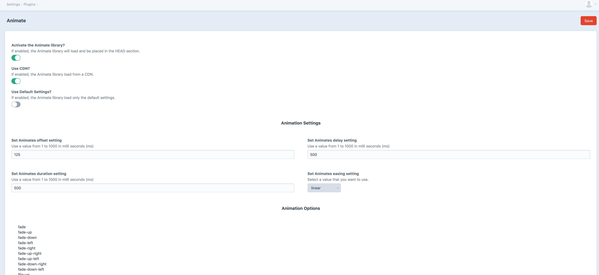

# Animate plugin for Craft CMS 3.x | 4.x

This will animate elements using AOS from https://github.com/michalsnik/aos

## Requirements

This plugin requires Craft CMS 3.0.0-beta.23 or later.

## Installation

To install the plugin, follow these instructions.

1. Open your terminal and go to your Craft project:

        cd /path/to/project

2. Then tell Composer to load the plugin:

        composer require swdevelopment/animate

3. In the Control Panel, go to Settings → Plugins and click the “Install” button for animate.

  or

        ./craft plugin/install animate

## Animate Overview

Animate save you time by loading the files needed to run the Animate On Scroll library and allows you add animation elements in your templates.  

## Configuring Animate

To start using Animate, just navigate to the Control Panel and click on the Animate plugin.

1. To activate be sure to make sure you turn the Activate Animate lightswitch on.
2. To use a CDN with the library, be sure to turn the Use CDN lightswitch on. It is good practice to use a CDN in production environments. If you are developing locally, there is no need to turn it on.

## Using Animate

To use Animate inside of a template, simply add the **data-aos** tags to any element. Full usage of the library is completely up to you.

- animations are used with the attribute **data-aos**  
- settings can be overridden with the attribute **data-aos-***

  - delay
  - duration
  - offset
  - easing
  - anchor
  - anchor-placement
  

#### Animation Options ( Fade )
| Animation Effect | Usage  |  
|------|-----------------|
|fade  | data-aos="fade" |
|    fade-up  |         data-aos="fade-up"        |  
|   fade-down   | data-aos="fade-down"                |
|   fade-left   | data-aos="fade-left"                |
|   fade-right   | data-aos="fade-down"                |
|   fade-up-right   | data-aos="fade-up-right"                |
|   fade-up-left   | data-aos="fade-up-left"                |
|   fade-down-right   | data-aos="fade-down-right"                |   
|   fade-down-left   | data-aos="fade-down-left"                |

Example code of a "flip-up":

    

        <h1 data-aos="slide-right" data-aos-delay="200" data-aos-duration="400">Welcome</h1>
    

For all animations, animation types and settings options, please refer to Animate's settings page.    

## Animate Roadmap

#### Future features:
  - Add the ability to edit animation inside the CP on any field.

Brought to you by [Tim Strawbridge](https://www.swdevteam.com?utm_source=github&utm_medium=website&utm_campaign=animate_plugin&utm_term=&utm_content=site_link)
